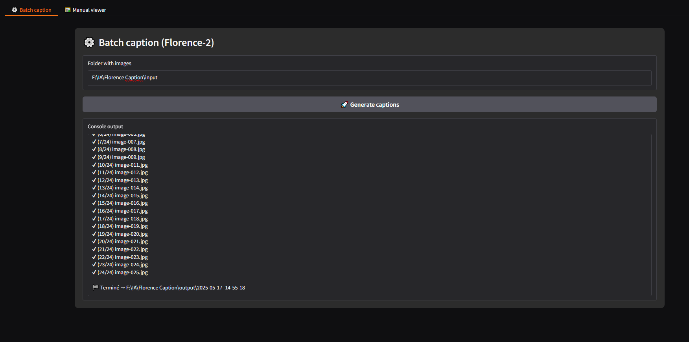
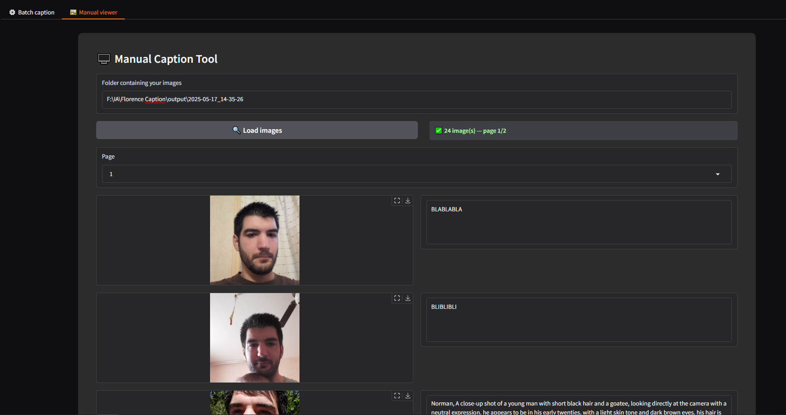

# Florence 2 Caption Tool — GUI v1.0  

### Interface complète (Gradio) pour :

1. **Batch Caption** – génère des descriptions automatiques d’images avec *MiaoshouAI / Florence‑2 PromptGen v2.0*.  
2. **Manual Viewer** – affiche les images 20 par 20, permet de relire / corriger chaque prompt à la main et de sauvegarder instantanément.   

> ⚡ Optimisé CUDA / fp16 & SDPA — fonctionne aussi en CPU si nécessaire.

> **Windows ou Linux**
> Une carte NVIDIA est recommandée.

---
  

## 1. Installation rapide

1. Python 3.10 64-bit | <https://www.python.org/downloads/release/python-31011/> (✔ cocher *“Add to PATH”* ; redémarrer)
2. Lancez **`start.bat`** OU **`start.sh`**  

Vos images presentes dans le dossier (que vous avez selectionné) **`input/`**, seront automatiquement envoyé vers le dossier **`/Florence Caption/output/DossierHorodaté/ici`**.
Vous pourrez donc par la suite passer sur le tab Manual Viewer, qui vous permettra d'editer les prompts à la main s'ils ne vous conviennent pas, l'enregistrement s'effectue lorsque vous cliquez en dehors de la zone texte.   

## 🙏 Crédits

- [Microsoft / Florence-2](https://huggingface.co/microsoft)
- [MiaoshouAI / Florence‑2 PromptGen v2.0](https://huggingface.co/MiaoshouAI/Florence-2-base-PromptGen-v2.0)
- [Hugging Face Transformers](https://github.com/huggingface/transformers)
- [timm](https://github.com/huggingface/pytorch-image-models)