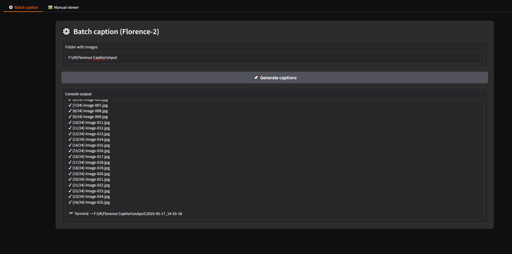
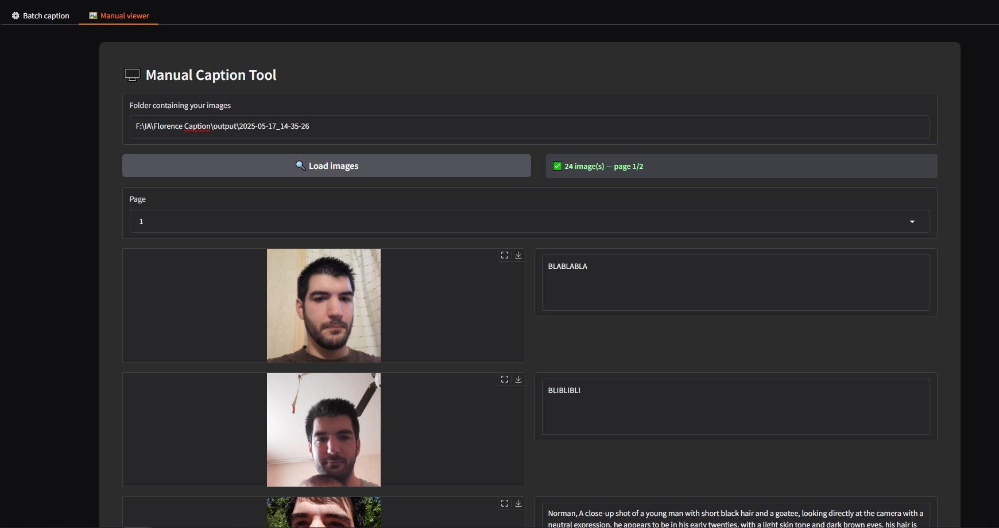

# Florence 2 Caption Tool — GUI v1.0  

### Complete Interface (Gradio) for:

1. **Batch Caption** – generates automatic image descriptions with *MiaoshouAI / Florence‑2 PromptGen v2.0*.
2. **Manual Viewer** – displays images 20 by 20, allows you to reread / correct each prompt manually and save instantly.   

> ⚡ Optimized CUDA / fp16 & SDPA — also works on CPU if needed.

> **Windows or Linux**
> An NVIDIA graphics card is recommended.

---
  

## Quick Installation

1. Python 3.10 64-bit | <https://www.python.org/downloads/release/python-31011/> (✔ check *"Add to PATH"* ; restart)

2. Run **`start.bat`** OR **`start.sh`**  

Your images located in the selected folder **`input/`**, will be automatically sent to the folder **`/Florence Caption/output/TimestampedFolder/here`**.
You can then switch to the Manual Viewer tab, which will allow you to edit the prompts manually if they don't suit you. Saving is done when you click outside the text area.   

## 🙏 Credits

- [Microsoft / Florence-2](https://huggingface.co/microsoft)
- [MiaoshouAI / Florence‑2 PromptGen v2.0](https://huggingface.co/MiaoshouAI/Florence-2-base-PromptGen-v2.0)
- [Hugging Face Transformers](https://github.com/huggingface/transformers)
- [timm](https://github.com/huggingface/pytorch-image-models)